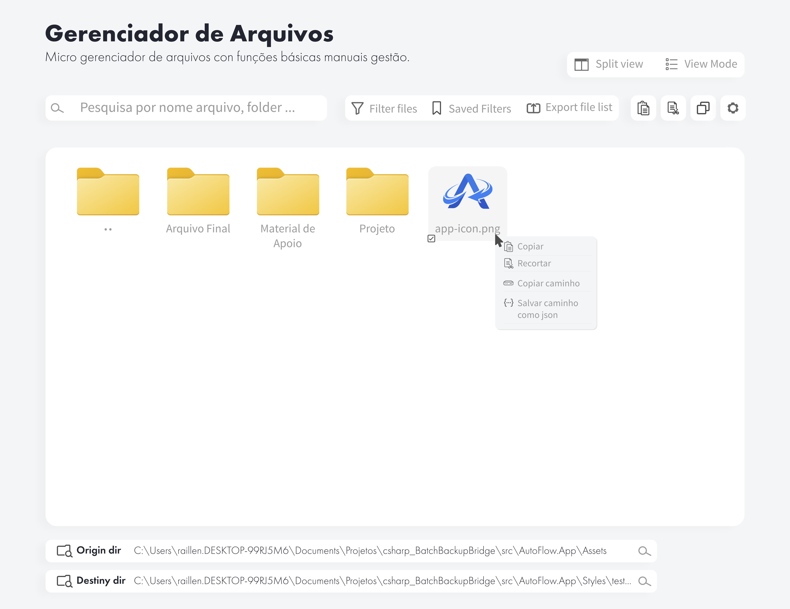

<p align="center">
  
</p>

<h1 align="center">TidyFlow</h1>

<p align="center">
  Automação desktop local para organizar, mover, copiar e auditar fluxos de arquivos.
</p>

<p align="center">
  <a href="./README.md">English</a>
  ·
  <a href="./README.pt-BR.md">Português</a>
  ·
  <a href="./README.ja-JP.md">日本語</a>
</p>

<p align="center">
  
  
  
  
  
</p>

<p align="center">
  
</p>

## Menu

- [Visão Geral](#visão-geral)
- [Status do Projeto](#status-do-projeto)
- [O Que o TidyFlow Faz](#o-que-o-tidyflow-faz)
- [Arquitetura](#arquitetura)
- [Estrutura do Repositório](#estrutura-do-repositório)
- [Stack Técnica](#stack-técnica)
- [Primeiros Passos](#primeiros-passos)
- [Comandos de Desenvolvimento](#comandos-de-desenvolvimento)
- [Mapa da Documentação](#mapa-da-documentação)
- [Segurança e Privacidade](#segurança-e-privacidade)
- [Roadmap](#roadmap)
- [Contribuição](#contribuição)
- [Licença](#licença)
- [Suporte](#suporte)

## Visão Geral

TidyFlow é um aplicativo desktop para quem executa tarefas repetidas com arquivos e precisa entender com clareza o que aconteceu, o que está rodando e o que vai rodar depois.

Ele combina interface em Svelte, shell desktop em Tauri e núcleo em Rust. O app foi pensado para rodar localmente, salvar dados operacionais em SQLite e manter operações de arquivo atrás de comandos Rust explícitos, sem entregar acesso direto ao filesystem para o frontend.

Este repositório contém a reescrita v2. Alguns crates internos e documentos técnicos antigos ainda usam o namespace `autoflow-*`. O nome público do produto é **TidyFlow**.

## Status do Projeto

| Item | Status |
| --- | --- |
| Versão | `0.2.1-alpha` |
| Nome do produto | TidyFlow |
| Namespace Rust interno | `autoflow-*` |
| Shell desktop | Tauri 2 |
| Frontend | Svelte 5 + TypeScript |
| Core backend | Workspace Rust |
| Persistência | SQLite via `sqlx` |
| CI | Pipeline GitLab para checks de UI, testes Rust e testes de UI |

Este é um projeto em alpha. Os fluxos principais já existem, mas APIs, detalhes de UI e empacotamento ainda podem mudar antes de uma versão estável.

## O Que o TidyFlow Faz

| Área | Descrição |
| --- | --- |
| Transferências | Cria jobs de cópia ou movimentação com origem, destino, filtros, regras de conflito e opções de execução. |
| Simulação | Mostra o resultado de jobs e blueprints antes de alterar arquivos em disco. |
| Pastas monitoradas | Observa diretórios e enfileira tarefas quando eventos de arquivo estabilizam. |
| Agendamento | Executa jobs por intervalo ou por agenda baseada em data e horário. |
| Blueprints | Organiza arquivos ou pastas com templates de nome, contadores, planos de pastas e variáveis. |
| Auditoria | Consulta eventos processados, mostra detalhes, resume atividade e exporta logs em CSV ou JSON. |
| Painel admin | Mostra dados locais de frota, jobs ativos, fila de comandos e payloads assinados de heartbeat para fluxos com agent gerenciado. |
| Configurações | Ajusta aparência, idioma, performance, segurança, notificações, manutenção e suporte. |

TidyFlow é feito para automação prática de arquivos, sem comportamento escondido. A UI deixa visíveis o status de execução, a atividade recente, as falhas e as próximas execuções.

## Arquitetura

```text
UI Svelte
  -> Commands e events Tauri
    -> Serviços de aplicação Rust
      -> Regras de domínio
      -> Repositórios SQLite
      -> Filesystem, watcher, scheduler e notificações
```

Limites principais:

| Camada | Local | Responsabilidade |
| --- | --- | --- |
| App desktop | `apps/desktop` | Rotas Svelte, contratos de UI, shell Tauri e configuração do app. |
| Domínio | `crates/autoflow-domain` | Jobs, blueprints, filtros, agendas, configurações, auditoria, tokenizer e regras de path. |
| Aplicação | `crates/autoflow-application` | Casos de uso para jobs, execução, blueprints, scripts, notificações e pacotes. |
| Infraestrutura | `crates/autoflow-infrastructure` | SQLite, migrations, settings persistidas, auditoria, secrets e estado de UI. |
| Runtime core | `crates/autoflow-core` | Estado do app, fila, scheduler, watchers, ações admin e emissão de eventos. |
| Admin server | `crates/autoflow-admin-server` | Primitivos HTTP administrativos para fluxos de gerenciamento remoto. |

## Estrutura do Repositório

```text
.
├── apps/
│   └── desktop/                 # Aplicativo desktop Tauri 2 + Svelte 5
├── crates/
│   ├── autoflow-domain/         # Modelo de domínio puro e regras
│   ├── autoflow-application/    # Casos de uso e orquestração
│   ├── autoflow-infrastructure/ # SQLite, settings, auditoria, secrets, storage
│   ├── autoflow-core/           # Runtime, fila, scheduler, watchers
│   └── autoflow-admin-server/   # Primitivos do servidor admin
├── docs/
│   ├── v2/                      # Arquitetura, IPC, roadmap e stack
│   ├── WIKI/                    # Páginas para usuários
│   ├── adr/                     # Decisões de arquitetura
│   ├── plans/                   # Planos e análises de features
│   └── specs/                   # Contratos e schemas
├── tests/
│   └── e2e/                     # Testes Playwright
├── Cargo.toml                   # Workspace Rust
├── package.json                 # Scripts do workspace pnpm
├── pnpm-workspace.yaml
└── README.md
```

## Stack Técnica

| Área | Ferramentas |
| --- | --- |
| Desktop | Tauri 2 |
| UI | Svelte 5, SvelteKit, TypeScript, Vite |
| Validação de UI | Zod, Vitest, Playwright |
| Runtime async Rust | Tokio |
| Persistência | SQLite, `sqlx`, migrations |
| Monitoramento de arquivos | `notify`, `notify-debouncer-full` |
| HTTP/admin | Axum, Reqwest |
| Empacotamento | Tauri bundler |
| Workspace | pnpm workspaces + Cargo workspace |

## Primeiros Passos

### Pré-requisitos

- Node.js 20 LTS ou superior
- pnpm via Corepack
- Toolchain Rust stable
- Dependências de sistema exigidas pelo Tauri no seu sistema operacional

### Instalar

```bash
git clone https://github.com/raillen/tidyflow.git
cd tidyflow
corepack enable
pnpm install
```

### Rodar o app desktop

```bash
pnpm dev
```

O script `dev` da raiz inicia o app desktop Tauri pelo pacote `@tidyflow/desktop`.

## Comandos de Desenvolvimento

| Comando | Uso |
| --- | --- |
| `pnpm dev` | Roda o app desktop Tauri + Svelte em modo desenvolvimento. |
| `pnpm build` | Gera o bundle do aplicativo desktop. |
| `pnpm check` | Executa checks Svelte e TypeScript do pacote desktop. |
| `pnpm test` | Executa testes unitários do frontend. |
| `pnpm test:rust` | Executa `cargo test --workspace`. |
| `pnpm --filter @tidyflow/desktop check` | Checa apenas o pacote desktop. |
| `cargo test --workspace` | Executa todos os testes Rust diretamente. |

## Mapa da Documentação

| Documento | Use para |
| --- | --- |
| [`docs/v2/ARCHITECTURE.md`](./docs/v2/ARCHITECTURE.md) | Arquitetura de runtime, camadas e fluxos. |
| [`docs/v2/API-IPC.md`](./docs/v2/API-IPC.md) | Contratos de commands e events Tauri. |
| [`docs/v2/DOMAIN.md`](./docs/v2/DOMAIN.md) | Entidades de domínio, invariantes e regras. |
| [`docs/v2/ROADMAP.md`](./docs/v2/ROADMAP.md) | Fases planejadas e critérios de entrega. |
| [`docs/v2/STACK.md`](./docs/v2/STACK.md) | Stack técnica e escolhas de bibliotecas. |
| [`docs/WIKI/User-Guide.md`](./docs/WIKI/User-Guide.md) | Guia voltado ao usuário. |
| [`docs/adr/`](./docs/adr/) | Decisões de arquitetura. |

A documentação v2 está sendo alinhada com o código alpha atual. Quando houver conflito, prefira o código, os manifestos e este README raiz para a visão pública do projeto.

## Segurança e Privacidade

TidyFlow foi desenhado com execução local e limites explícitos:

- Dados de runtime ficam em SQLite local.
- Operações de arquivo passam por comandos Rust.
- Validação de paths fica centralizada em regras de domínio/core.
- A UI não controla diretamente o comportamento baixo nível do filesystem.
- Secrets do agent admin passam pelas configurações do app e pelo caminho de keyring da plataforma.
- Comandos admin destrutivos são representados como requisições explícitas.

Nota alpha: revise manifestos, settings e configuração de distribuição antes de usar o TidyFlow em fluxos sensíveis de produção.

## Roadmap

O trabalho de curto prazo foca na estabilização da base v2:

- reforçar execução e cancelamento de transferências;
- manter jobs, watch, agenda e blueprints consistentes;
- melhorar textos traduzidos nas localidades suportadas;
- finalizar empacotamento e configuração de updater;
- ampliar cobertura Playwright para fluxos desktop completos;
- alinhar documentos antigos AutoFlow com o nome atual TidyFlow.

Veja [`docs/v2/ROADMAP.md`](./docs/v2/ROADMAP.md) para o plano detalhado.

## Contribuição

Contribuições são bem-vindas enquanto o projeto está em alpha. Mantenha mudanças pequenas e verificáveis.

Antes de abrir um pull request:

1. Rode os checks relevantes.
2. Atualize a documentação quando comportamento, setup, comandos ou contratos mudarem.
3. Mantenha textos de UI curtos, concretos e acessíveis.
4. Evite UI placeholder para features incompletas.
5. Informe limitações conhecidas com clareza.

Checks recomendados:

```bash
pnpm check
pnpm test
pnpm test:rust
```

## Licença

TidyFlow usa licenciamento por pacote. Os manifestos de cada pacote são a fonte de verdade para cada parte do repositório.

| Área | Licença |
| --- | --- |
| `crates/autoflow-domain` | `MIT OR Apache-2.0` |
| `crates/autoflow-core` | `MIT OR Apache-2.0` |
| Crates do workspace e app desktop que herdam a metadata do workspace | `GPL-3.0-only` |

Veja [`LICENSE`](./LICENSE), [`LICENSE-MIT`](./LICENSE-MIT) e [`LICENSE-APACHE`](./LICENSE-APACHE).

## Suporte

TidyFlow é desenvolvido por [Raillen Santos](https://github.com/raillen).

- Site: [raillen.site](https://raillen.site)
- GitHub: [github.com/raillen](https://github.com/raillen)
- Buy Me a Coffee: [buymeacoffee.com/raillen](https://www.buymeacoffee.com/raillen)
