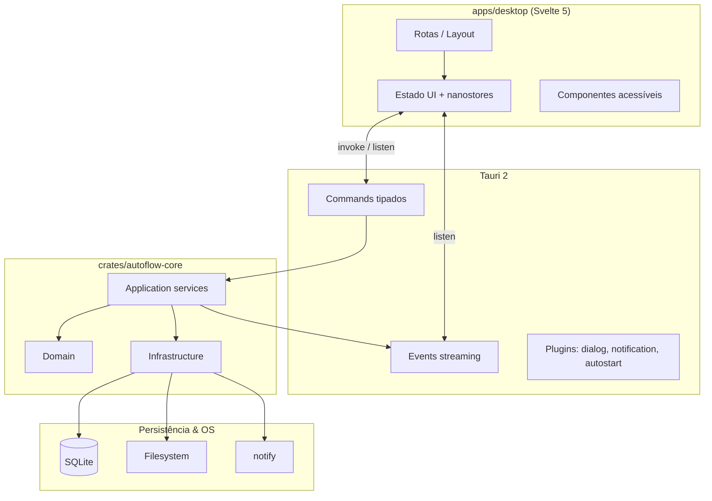

# Arquitetura — AutoFlow v2

**Status:** `Planejado`

---

## 1. Visão geral

O AutoFlow v2 separa **interface** (Svelte no WebView do Tauri) do **núcleo** (Rust). O núcleo permanece ativo com a janela fechada (tray), processando watch, fila e agendamentos.



---

## 2. Crates Rust (backend)

| Crate | Responsabilidade |
|-------|------------------|
| `autoflow-domain` | Entidades, value objects, erros de domínio, regras puras |
| `autoflow-application` | Use cases, ports (traits), orquestração |
| `autoflow-infrastructure` | SQLite, filesystem, watch, scheduler, notify, crypto |
| `autoflow-core` | Wiring DI, estado global, emissão de eventos |
| `autoflow-tauri` | Commands, Specta bindings, plugins |

**Regra:** `domain` não depende de `infrastructure` nem de `tauri`.

---

## 3. Módulos funcionais

### 3.1 Transfer (Jobs)

- CRUD, execução, cancelamento, retry de falhas
- Filtros, conflitos, smart sync, hash, criptografia, ZIP, retenção
- Simulação (dry-run) reutilizando pipeline de filtros

### 3.2 Organization (Blueprints)

- Templates de renomeação (tokenizer)
- Scaffolding de pastas
- Watch reativo + batch manual

### 3.3 Scheduling

- Tipos: manual, interval, daily, weekly
- Persistência de `next_run`; loop tokio no core

### 3.4 Execution

- Fila prioritária, concorrência configurável
- Progress events por arquivo
- Failure store + rollback manifest

### 3.5 Audit

- Log append-only
- Query paginada, export CSV, purge, resumo diário

### 3.6 Authorization (transversal)

- `PathPolicy`: valida paths contra raízes de jobs/blueprints
- Usado em browse seguro (v2), pickers e operações de IO

---

## 4. Fluxos principais

### 4.1 Executar job manualmente

```
UI: runJob(id)
  → Command: jobs_run
  → EnqueueJob use case
  → Worker pega da fila
  → ExecutionPipeline por arquivo
  → emit("execution_progress", payload)
  → emit("execution_completed", payload)
UI: listen → atualiza store → componentes reativos
```

### 4.2 Watch folder

```
notify detecta evento
  → debounce + settle time
  → EnqueueJob (se job watch enabled)
  → mesmo pipeline de execução
```

### 4.3 Blueprint em evento

```
notify detecta arquivo/pasta nova
  → MatchBlueprint use case
  → Tokenizer aplica rename / scaffolding
  → Audit entry (tipo ORGANIZATION)
```

---

## 5. Persistência

**SQLite** como única fonte de verdade em runtime.

| Tabela | Uso |
|--------|-----|
| `jobs` | Config serializada + índices de busca |
| `blueprints` | Config + enabled |
| `settings` | KV global |
| `audit_entries` | Histórico imutável |
| `executions` | Estado ativo e histórico curto |
| `failures` | Retry queue por job |
| `rollback_manifests` | Último manifest por job |
| `blueprint_counters` | Estado de contador por blueprint |
| `authorized_paths_cache` | Opcional; invalidada por trigger |

Migrations: `refinery` ou `sqlx migrate` em `crates/autoflow-infrastructure/migrations/`.

**Import v1:** script one-shot lê JSON legado → insere SQLite (fora do MVP).

---

## 6. Segurança de paths

```rust
fn is_authorized(path: &Path, roots: &[PathBuf]) -> bool {
    let normalized = normalize(path);
    roots.iter().any(|root| {
        let r = normalize(root);
        normalized == r || normalized.starts_with(&(r + MAIN_SEPARATOR))
    })
}
```

- Normalizar: `dunce`, canonicalize quando possível
- Recusar `..` traversal após normalização
- Cache invalidado em: job/blueprint saved/deleted

---

## 7. Frontend (Svelte)

### Camadas

| Camada | Pasta | Função |
|--------|-------|--------|
| **Routes** | `src/routes/` | Páginas (Dashboard, Flows, Blueprints, History, Settings) |
| **Features** | `src/lib/features/` | Lógica por domínio (jobs, blueprints…) |
| **Shared UI** | `src/lib/components/ui/` | Primitivos (Button, Dialog…) via bits-ui |
| **Core** | `src/lib/core/` | IPC client, stores, i18n, theme |
| **Contracts** | `src/lib/contracts/` | Tipos TS gerados + Zod schemas |

### Estado

- **nanostores** — estado global leve (sessão, tema, execuções ativas)
- **Runes locais** — estado de componente/formulário
- **Sem polling** — `listen()` Tauri alimenta stores

---

## 8. Observabilidade

| Tipo | Ferramenta |
|------|------------|
| Logs Rust | `tracing` + `tauri-plugin-log` |
| Erros UI | toast acessível + entrada no audit |
| Métricas dashboard | query SQLite + stream de eventos |
| Dev | Tauri DevTools + `tracing-subscriber` |

---

## 9. O que melhoramos vs v1

| Problema v1 | Solução v2 |
|-------------|------------|
| ViewModel → SqliteAuditService | UI → IPC → trait AuditPort |
| Timer 1s refresh | Events Tauri |
| JSON + SQLite mistos | SQLite único |
| FileExplorer sem UI | Browse seguro na Fase 5, atrás de PathPolicy |
| bypassAuth em search | Removido; API sempre valida |
| Stats placeholder | Dashboard só exibe dados de query real |
| SMTP wired parcial | Fase 4; flag até teste E2E |

---

## 10. Validação

```bash
cargo test --workspace
cargo clippy --workspace -- -D warnings
pnpm --filter desktop check        # svelte-check + tsc
pnpm --filter desktop test
pnpm --filter desktop lint
```

Critério de merge: testes verdes + doc da feature atualizada.
