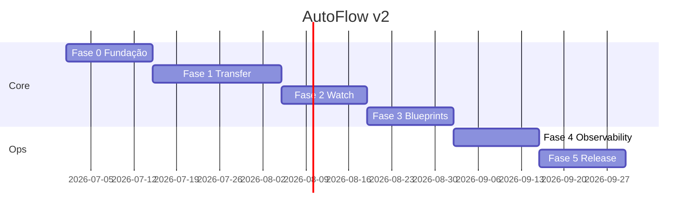

# Roadmap — AutoFlow v2

**Status:** `Planejado`

Implementação faseada. **Definition of Done (DoD)** igual em todas as fases.

---

## Definition of Done (global)

Uma feature só está pronta quando:

1. Use case Rust + testes (`cargo test`)
2. Command Tauri + evento (se aplicável) + bindings Specta
3. Zod schema + cliente IPC
4. Tela Svelte conectada (sem placeholder)
5. Teste UI (Vitest ou Playwright) do fluxo principal
6. Entrada i18n pt-BR + en-US
7. Doc atualizada em `docs/v2/`
8. axe sem violações críticas na tela tocada

---

## Fase 0 — Fundação (2 semanas)

**Objetivo:** monorepo compilando; IPC mínimo; shell UI.

### Entregas

- [ ] Monorepo pnpm + Cargo workspace
- [ ] SQLite schema v1 + migration inicial
- [ ] Crates: domain, application, infrastructure, core
- [ ] Tauri app com sidebar + 5 rotas vazias estilizadas
- [ ] Commands: `health`, `settings_get`, `settings_update`
- [ ] Theme light/dark (mode-watcher + tokens CSS)
- [ ] i18n Paraglide pt-BR/en-US scaffold
- [ ] CI: clippy + svelte-check

### DoD Fase 0

`pnpm tauri dev` abre janela com navegação funcional e tema alternável.

---

## Fase 1 — Transfer MVP (3 semanas)

**Objetivo:** CRUD job + execução manual + progresso + audit básico.

### Entregas

- [ ] Entidades Job, FileFilter, TransferOptions (domain)
- [ ] Execution pipeline copy/move local
- [ ] Fila single-worker + cancel
- [ ] Commands jobs CRUD + run + simulate
- [ ] Events `execution_progress`, `execution_completed`
- [ ] UI: lista fluxos, editor job (felte+zod), progresso live
- [ ] Audit append por arquivo
- [ ] PathPolicy v1

### Fora desta fase

Watch, schedule, blueprints, rollback.

---

## Fase 2 — Watch + Schedule (2 semanas)

**Objetivo:** automação sem clique.

### Entregas

- [ ] notify-debouncer-full integrado
- [ ] Settle time configurável
- [ ] Scheduler tokio (interval/daily/weekly)
- [ ] Tray icon + autostart plugin
- [ ] UI: toggle watch, campos schedule no editor
- [ ] Próximos runs no dashboard

---

## Fase 3 — Blueprints (2 semanas)

**Objetivo:** organização automática.

### Entregas

- [ ] Tokenizer completo + testes golden
- [ ] Blueprint CRUD + watch
- [ ] Scaffolding + rename file/folder
- [ ] Counter persistido SQLite
- [ ] UI blueprints + editor template com preview
- [ ] Audit status ORGANIZED

---

## Fase 4 — Observabilidade completa (2 semanas)

**Objetivo:** histórico, rollback, dashboard real, notificações.

### Entregas

- [ ] Audit query paginada + filtros
- [ ] Export CSV
- [ ] Rollback engine + UI confirm
- [ ] Dashboard stats reais (`audit_stats`)
- [ ] uPlot performance chart
- [ ] Webhook notifications (Rust reqwest)
- [ ] Purge logs + vacuum
- [ ] Command palette (cmdk-sv)

### Opcional nesta fase

- SMTP (se `CompositeNotification` equivalente em Rust)
- Window vibrancy Mica (Windows)

---

## Fase 5 — Polish + migração (2+ semanas)

**Objetivo:** browse seguro, import v1, release.

### Entregas

- [ ] Browse seguro (`browse_list_directory`) + UI grid
- [ ] Script migrate v1 JSON → SQLite
- [ ] Instalador Tauri bundler (MSI/dmg/AppImage)
- [ ] Auto-updater plugin
- [ ] Documentação usuário (`docs/WIKI/User-Guide-v2.md`)
- [ ] Playwright E2E suite completa
- [ ] SFTP operator (exploratório → v2.1 se atrasar)

---

## Cronograma visual

Datas ilustrativas — ajustar ao início real.

---

## Riscos e mitigação

| Risco | Mitigação |
|-------|-----------|
| Curva Rust | Fase 0 dedicada; domain testável cedo |
| IPC drift TS/Rust | tauri-specta obrigatório no CI |
| Performance listas audit | TanStack Virtual desde Fase 4 |
| Windows-only APIs | Feature flags `cfg(windows)` |
| Scope creep File Browser | Fase 5; PathPolicy desde Fase 1 |

---

## Métricas de sucesso v2

- Bundle instalador < 25 MB (Windows)
- RAM ociosa UI < 120 MB
- Progress event latency < 300 ms
- 0 placeholders de stats na UI
- Migração v1 importa ≥ 95% jobs sem erro manual
